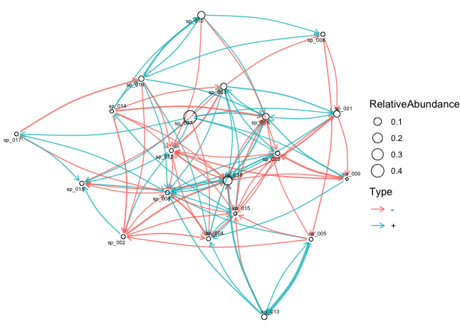
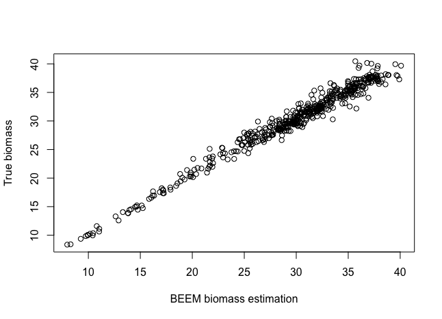
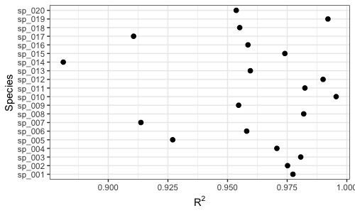
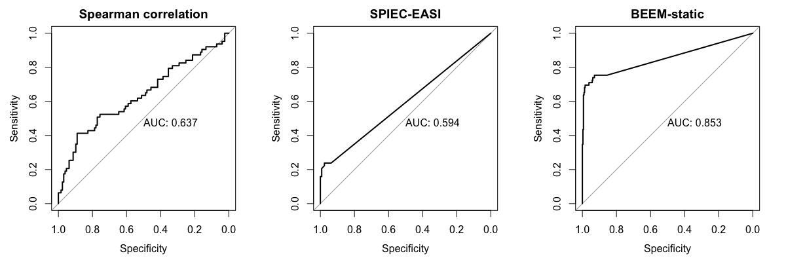

# BEEM-Static
 
 - Authors: Chenhao Li, Tamar V. Av-Shalom, Jun Wei Gerald Tan, Junmei Samantha Kwah, Kern Rei Chng and Niranjan Nagarajan
 
## Description


BEEM-Static is an R package for learning **directed microbial interactions** from cross-sectional microbiome profiling data based on the generalized Lotka-Volterra model (gLVM). Extending the core idea of the original BEEM algorithm for longitudinal data ([Reference](https://rdcu.be/bPl3T), [Source code](https://github.com/CSB5/BEEM)), BEEM-Static directly works with **relative abundances** to jointly estimate **total biomass** and **gLVM parameters**, thus eliminating the need for experimentally quantifying absolute abundances. BEEM-Static identifies microbiomes that are not at equilibrium states and automatically excludes such samples from the analysis. The package also provides the user with a collection of utility functions for visualizing and diagnosing the fitted model.

**Note**: This package is under active development. Please record the commit ID for reproducibility.

## Installation

```r
devtools::install_github('lch14forever/BEEM-static')
library(beemStatic)
```

## Example usage

### Dataset

The demo dataset is a simulated community of 20 species and 500 samples. All of the samples are at quilibrium states (generated by numerically integrating the gLVM until convergence) and each sample contains 70% of species as being randomly selected (i.e. each species has 70% habitat preference). 

```r
data("beemDemo")
attach(beemDemo)

## Use `?beemDemo` to see the help for fields in this dataset
```

### Analysis with BEEM-Static

BEEM-Static is run by calling the `func.EM` function.

```r
res <- func.EM(dat.w.noise, ncpu=4, scaling=median(biomass.true))
```

#### Visualizing inferred interaction network

We provide a function `showInteraction` to plot the interaction network inferred by BEEM-Static (based on the [ggraph](https://github.com/thomasp85/ggraph) package).

```r
showInteraction(res, dat.w.noise)
```


#### Estimating biomass

BEEM-Static also estimates the biomass for each sample (retrieved by the `beem2biomass` function). Here we can compare the estimated biomass with the true biomass on this simulated dataset.

```r
plot(beem2biomass(res), biomass.true, xlab='BEEM biomass estimation', ylab='True biomass')
```


#### Investigating model fit

We provide a function `diagnoseFit` to plot the [coefficient of determination](https://en.wikipedia.org/wiki/Coefficient_of_determination) (R<sup>2</sup>) for each species. A high R<sup>2</sup> (close to 1) value indicates that the variation in the data is well explained by the model.

```r
diagnoseFit(res, dat.w.noise, annotate = FALSE)
```


### Comparing BEEM-Static with correlation based methods

We now run two popular methods for inferring microbial interactions on our simulated data. Both methods try to infer a correlation matrix as a proxy for the interaction matrix.

1. Using a naive Spearman correlation method

```r
spearman <- cor(t(dat.w.noise), method='spearman')
```

2. Using [SPIEC-EASI](https://github.com/zdk123/SpiecEasi)
```r
## devtools::install_github("zdk123/SpiecEasi")
library(SpiecEasi)
se <- spiec.easi(t(dat.w.noise), method='mb')
se.stab <- as.matrix(getOptMerge(se))
```

3. Using BEEM-Static

```r
est <- beem2param(res)
```

We implement a function `auc.b` for ploting the receiver operating characteristic (ROC) curve with computed area under the curve (AUC). We compare the ROC curves for the above three methods.

```r
par(mfrow=c(1,3))
auc.b(spearman, scaled.params$b.truth, is.association = TRUE, main='Spearman correlation')
auc.b(se.stab, scaled.params$b.truth, is.association = TRUE, main='SPIEC-EASI')
auc.b(est$b.est, scaled.params$b.truth, main='BEEM-static')
```



## Citation

 - C Li, T V Av-Shalom et al. BEEM-Static: Accurate inference of ecological interactions from cross-sectional metagenomic data. [*bioRxiv*](https://www.biorxiv.org/content/10.1101/2020.11.23.394999v1) 2020.

 - C Li, K R Chng, J S Kwah, T V Av-Shalom, L Tucker-Kellogg, N Nagarajan. An expectation-maximization algorithm enables accurate ecological modeling using longitudinal metagenome sequencing data. [*Microbiome*](https://rdcu.be/bPl3T) 2019.
 
## Contact

Please direct any questions or feeback to [Li Chenhao](mailto:lich@gis.a-star.edu.sg) and [Niranjan Nagarajan](mailto:nagarajann@gis.a-star.edu.sg). 
